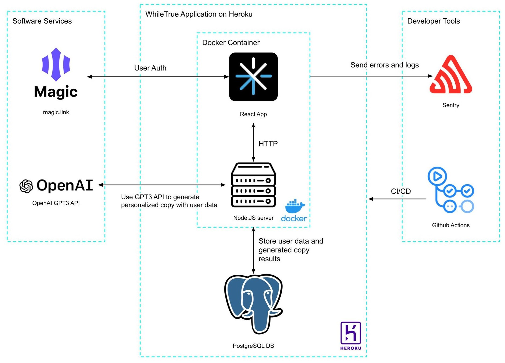

# WhileTrue

WhileTrue is a company founded in the marketing science industry.

Table of Contents
---
- [What is WhileTrue?](#what-is-whiletrue)
- [High-Level Architecture](#high-level-architecture)
- [People](./team/)
- [Diversity](./team/diversity.md)
- [Product & Research](./product_research/)
    - [Market](./product_research/market.md)
    - [Roadmap](./product_research/roadmap.md)

## What is WhileTrue?
WhileTrue is a SaaS that generates personalized marketing copy (for emails, SMS, etc) given the limited user data of a regulated industry such as finance.

## High-Level Architecture 
