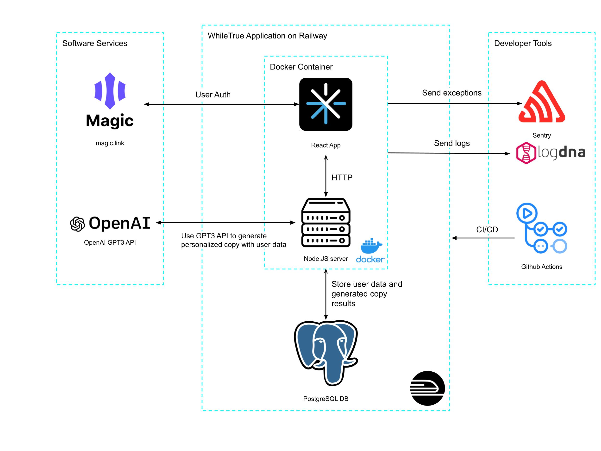

# WhileTrue

WhileTrue is a company founded in the marketing science industry.

Table of Contents
---
- [What is WhileTrue?](#what-is-whiletrue)
- [People](./team/)
- [Diversity](./team/diversity.md)
- [Product & Research](./product_research/)
    - [Market](./product_research/market.md)
    - [Roadmap](./product_research/roadmap.md)
- [High-Level Architecture](#high-level-architecture)
- [Getting Started](#getting-started)
- [Deployment](#deployment)

## What is WhileTrue?
WhileTrue is a SaaS that generates personalized marketing copy (for emails, SMS, etc) given the limited user data of a regulated industry such as finance.

## High-Level Architecture 

## Getting Started

These instructions are how to get the app up and running locally.

### Setup

Clone the repository `git clone https://github.com/dcsil/WhileTrue.git && cd WhileTrue/src`

### If running on docker

1. Run script to install and start docker `./script/bootstrap.sh`
2. Build docker compose images `docker-compose -p whiletrue build --no-cache`

### If running locally
1. Install dependencies `cd app && npm install && cd ../server && npm install`
2. Run client `cd app && npm start`
3. Open a new terminal window and run server `cd server && npm start`

## Deployment

### Continuous Integration

Github Actions is used for continuous integration.

### Logging

LogDNA is used to implement logging.

### Exception Handling

Sentry is used to implement exception handling.