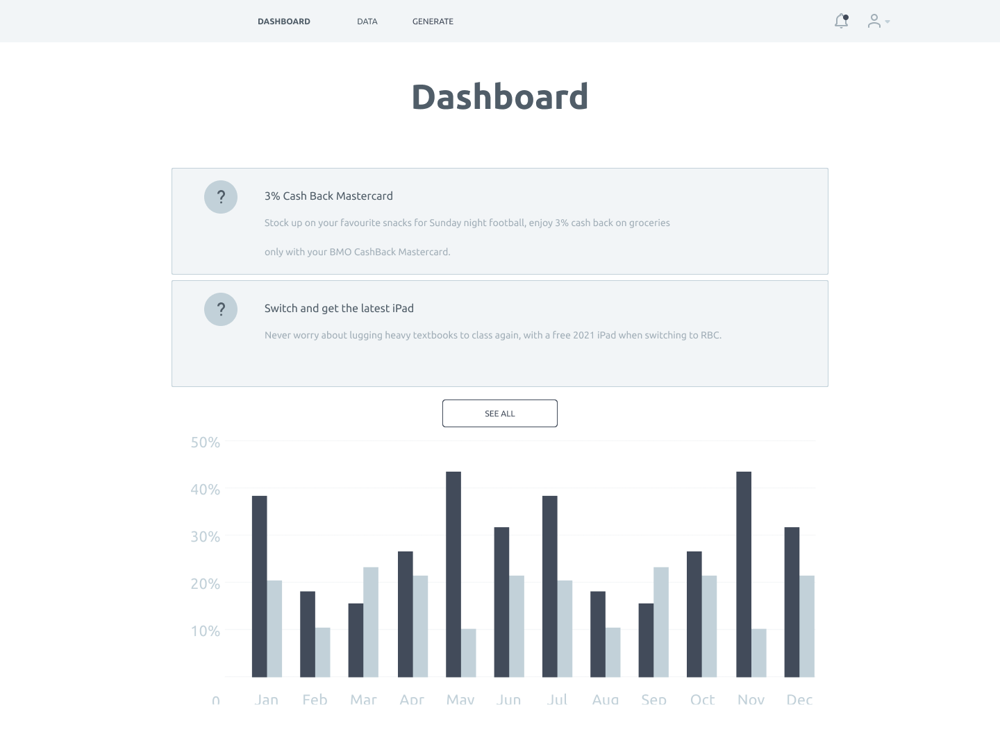
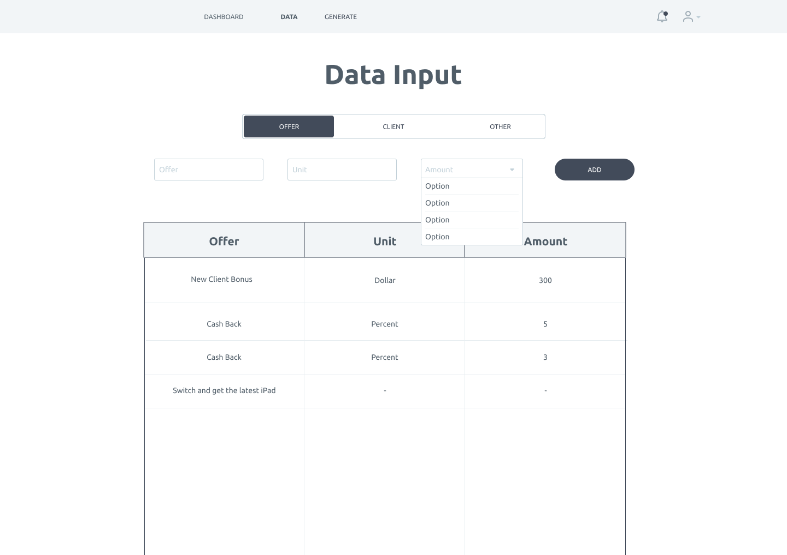
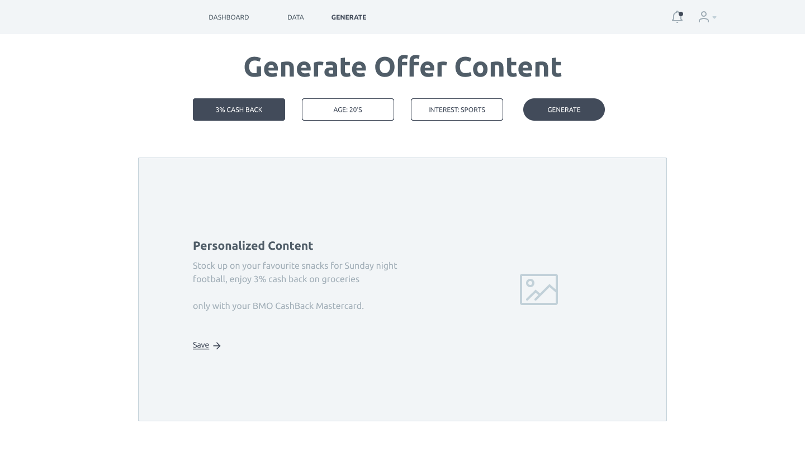

Use Cases:

1. Marketing teams have a dashboard to track past content and who it was sent to

2. Marketers input client data and offers and can choose which data should be weighted higher

3. WhileTrue generates personalized offer content

