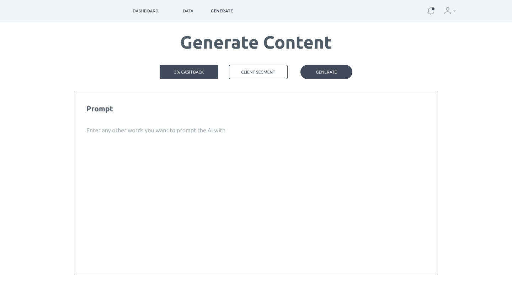
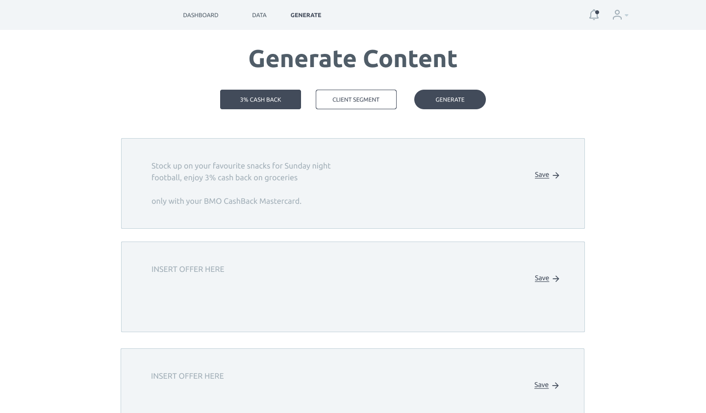
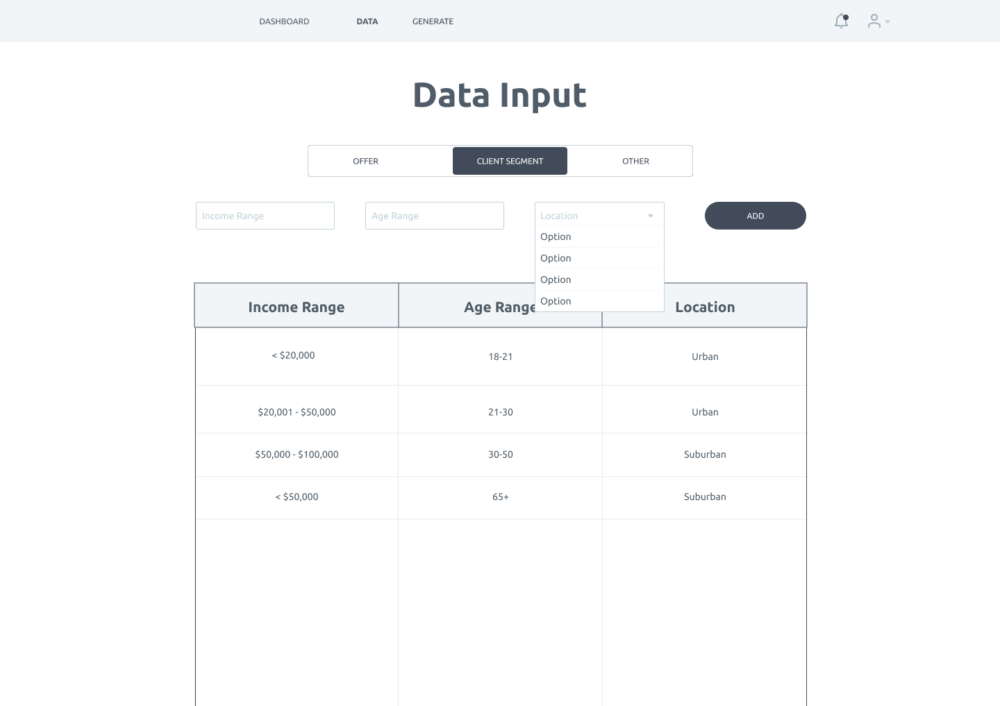
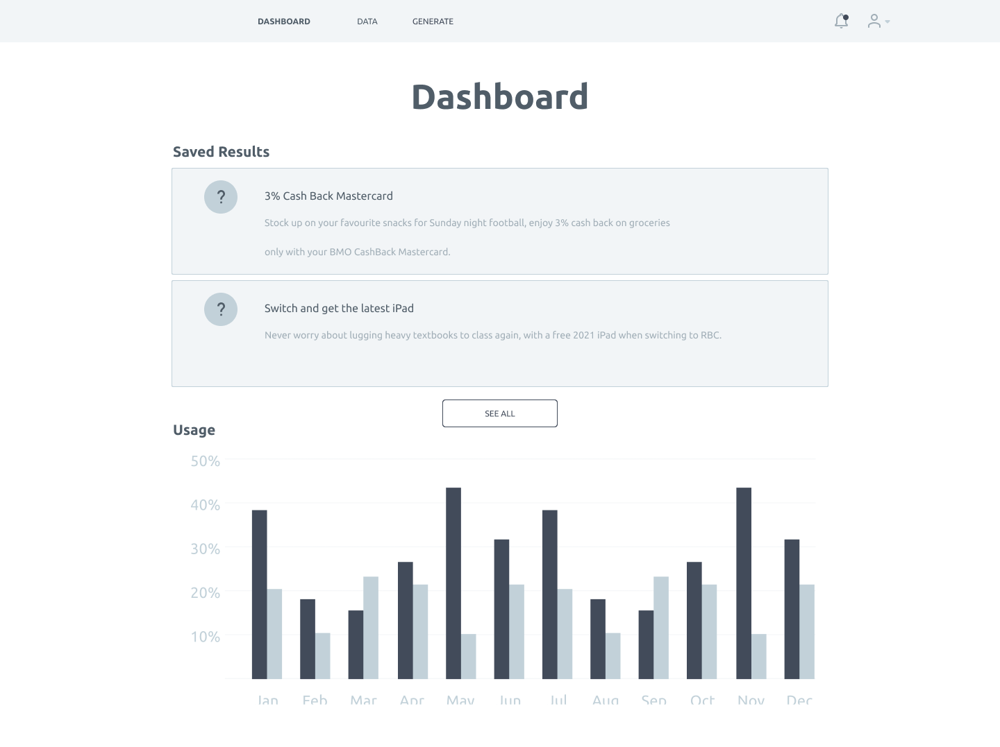

Use Cases:

1. WhileTrue generates personalized offer content

2. Marketers input client segment and offer data

3. Marketing teams have a dashboard to track and search saved content and see usage history

