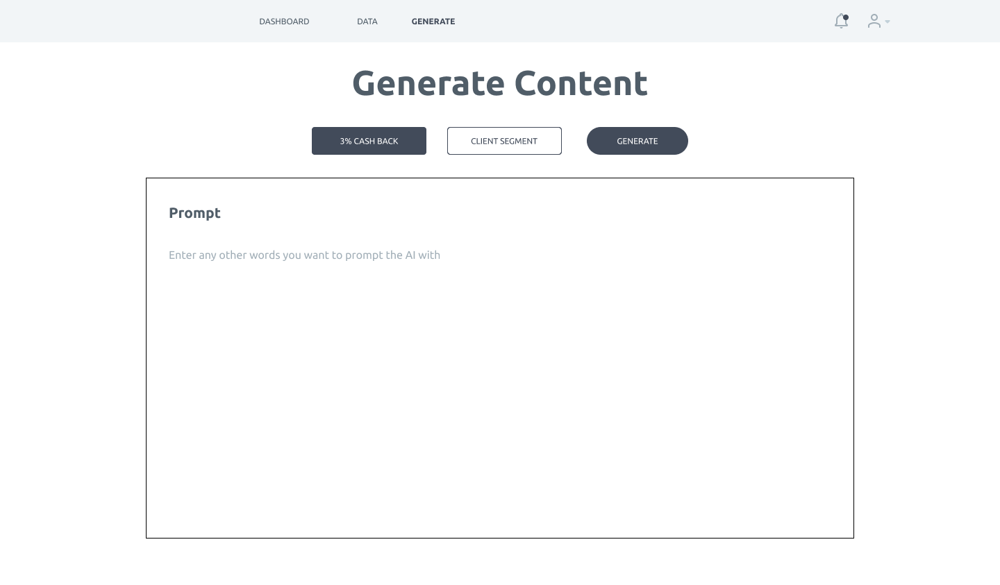
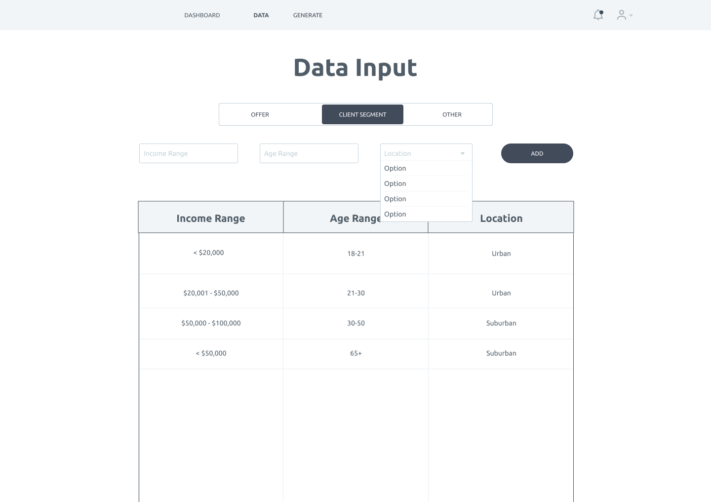

# UX Research Report

## Problem and Solution

The problem we are solving is that of impersonal marketing content. Everyone one our team has at some point been the target of either impersonal or generic marketing copy. This is a frequent problem and it leads to lower conversion rates, loss of customer trust, and subpar data collected for the company.

Our solution is an AI powered SaaS which given client and offer data, can generate personalized marketing copy to be used in campaigns. We will leverage GPT-3, a language model developed by OpenAI and widely regarded as the most expressive language model, to do the copy generation. A differentiating factor of our application is that we target regulated industries such as finance; it will be capable of creating personalized copy in the environment of limited available user data, and can content from our app can be used for copy ideation or to be directly sent to end customers.

## Overview

The purpose of this report is to provide insight into how our potential users work so that we can design our user interface to best serve our users. The research was conducted using a prototype which participants used to perform a variety of specific use cases.

## Prototype

The prototype was created with Figma and shown below.

## User Research

### Test Users

Because our app is targeted specifically towards marketers and marketing data scientists in the finance industry, we were limited to a test users from only a small user base who who fit this persona. Our first participant was a marketer who works at a Toronto finance startup. Their marketing reach spanned all of the company's client segments. Our second participant was a senior software engineer at Github with UX experience.

### Scenarios

The scenarios presented are:

1. Upload offer and client segment data for your current marketing campaing
2. Use the app to generate a few versions of marketing copy for this offer/client combo, and save the ones you like
3. View your previously saved copy.

### Research Process

The research process was:

1. Ask the partcipant for their consent to record and ues their feedback
2. Introduce the problem and solution we are building
3. Run through the scenarios given above while thinking out loud
4. Take notes on what went well, didn't go well, and what they wished to be able to do
5. Update roadmap based on user feedback

## Research Findings

Overall, we gained valuable feedback regarding how our application can better suit the user's workflow. Since none of the team memebers are marketers, there are a few key features that we failed to consider when initially designing our prototype. We also received positive feedback which confirmed our solution idea to be a successful solution to solving our business problem. The participant was engaged with the application and could see themselves using it in their workflow.

Are biggest priority is to add missing essential features to our mockup. These are features we did not consider because we did not have a deep understanding of a professional marketer's workflow:

- adding a search bar and a filter to every page, so that the user can search saved copy on the dashboard and previously inputted offer and client segment data
- adding the ability for users to customize the categories in the data they upload to give them finer control over the data used to generate copy
- nice to haves such as a character or word count cap on the generated content, ability to favorite generated copy, and ability to export data

Our goal is to add these features while maintaining the intuitiveness of our application. Because our solution is a very specialized SaaS, we were able to keep the design simple and easy to navigate. The simplicity is important for us to maintain as we add more features.

We also gained valuable feedback about our application's UI. Specifically, the data input on the mockup doesn't look like a data input form. Additionally, the prompt form on the content generation page is very ambiguous. Our participant was paused on that page for a long time, unsure of what to do. We plan to make it more informative in our implementation.

## Notes

### Worked well

- site pages were intuitive and easy to navigate
- easy to generate content and save the best results
- simple and unobtrusive design

### Problems

- no search bars or filters on any of the pages or dropdowns
- no way to add new categories for either offers or client segment data
- not possible to character/word count cap
- cannot export data
- perfer a way to specify between professional and friendly content wording
- input forms do not look like forms and content generation inputs look like buttons
- purpose of content generation prompt is unclear and it is not indicative what should be inputted or what it will do