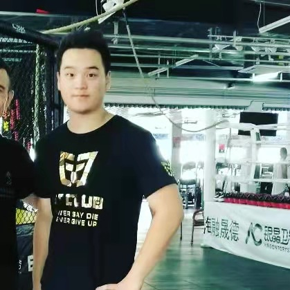

# Shuaitian Chen

- Software Developer
- shuaitian.chen@mail.utoronto.ca

## Links

- [GitHub](https://github.com/ShuaitianChen)
- [LinkedIn](www.linkedin.com/in/shuaitian-chen-b5775a207)
- [Resume](https://drive.google.com/file/d/1MFtJIrhgAg5AD-g-CVjqxjSzqnkMPfev/view?usp=sharing)

## About Shuaitian

Shuaitian is from China, but he finished high school in America and then attended college in Canada. Shuaitian has experience in backend,front end, and designing databases. In his spare time, he trains Muay Thai and watches UFC. 

## Strengths

- Backend programming.
- Using advanced data structures and algorithms.
- Familiar with many programming languages such as Python, Java, JavaScript.

## Weaknesses

- Front-end programming.
- Leadership skills.
- Sometimes reckless.
